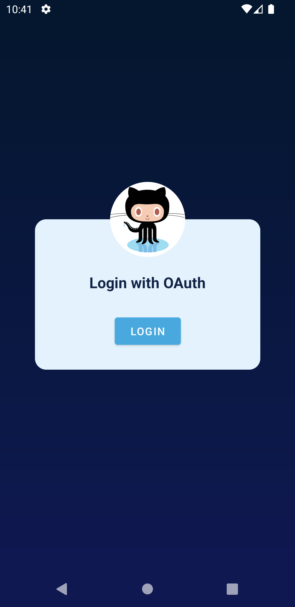
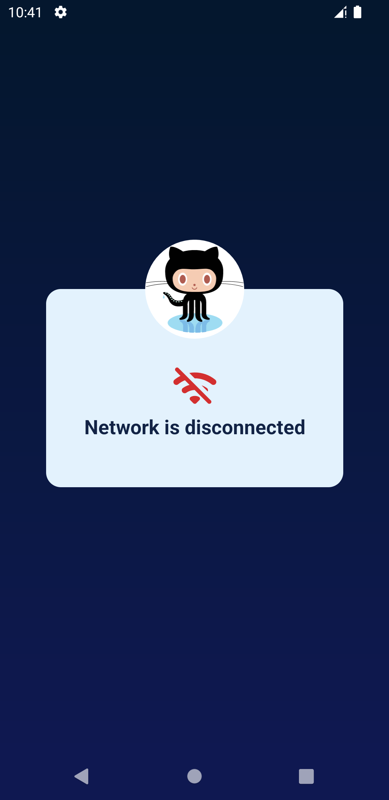
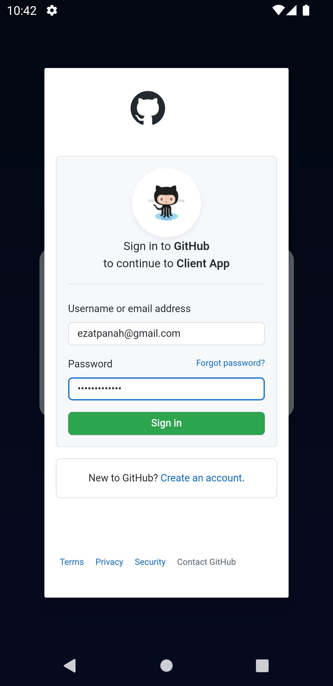
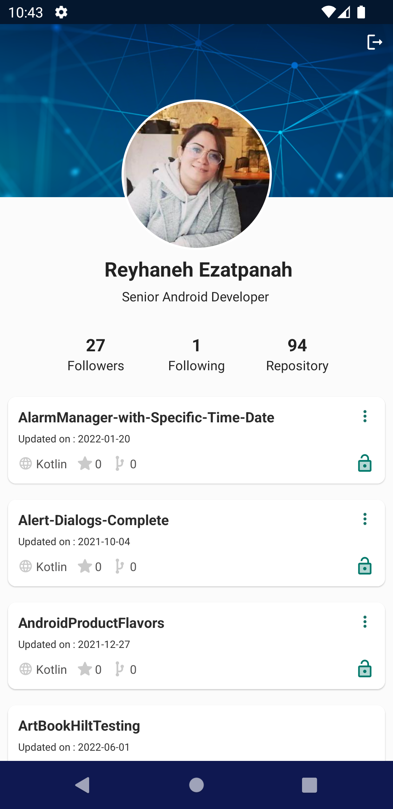

# GithubClient-MVP

<h3>OpenSource Project</h3>
 
Google Play link :
 
https://play.google.com/store/apps/details?id=com.ezatpanah.githubclient&pli=1
 

Overview :

The purpose of this application is to provide a list of user’s GitHub repositories and show the details of each repository :
* Language
* Star
* Fork
* Private or public

The app was written in Kotlin.

The API’s Docs: https://developer.github.com/v3/
 
 
Technologies and Libraries Used :
* MVP
* Navigation Component
* MotionLayout
* View Binding
* Retrofit
* Paging
* Dagger Hilt
* RxJava
* Live Data
* Coil

Screen-Shot :
 

